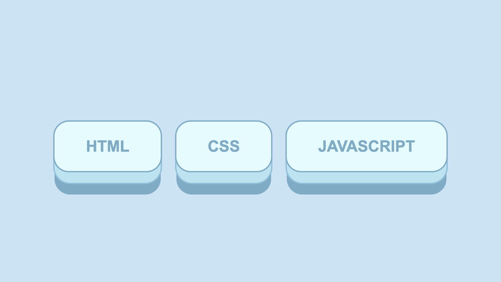

# 3D Push Button Hover Effect in HTML and CSS

A 3D push button hover effect in HTML and CSS is a visual enhancement technique used to create interactive and engaging user interfaces on a webpage. By implementing this effect, developers can add depth and interactivity to buttons, creating a sense of physicality and responsiveness when users interact with them. This effect typically involves transforming the button's appearance, such as adding a shadow or altering its position, when the user hovers over it with the cursor. By leveraging CSS properties like transform, box-shadow, and transition, developers can simulate a 3D effect that gives the impression of the button being pushed or raised, enhancing the overall user experience. This technique is commonly employed to draw attention to key interactive elements on a webpage, encouraging users to engage with the content and navigate the website more intuitively. By combining HTML for the structure and CSS for styling and animation, developers can easily create visually appealing and dynamic 3D push button hover effects that contribute to an engaging and immersive web design.

Youtube Tutorial Link: https://youtu.be/8NDEDJVTcaM

Live Preview: https://3dpushbutton.vercel.app/

